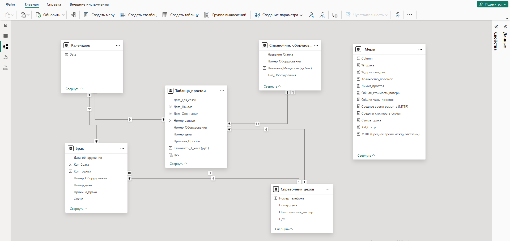
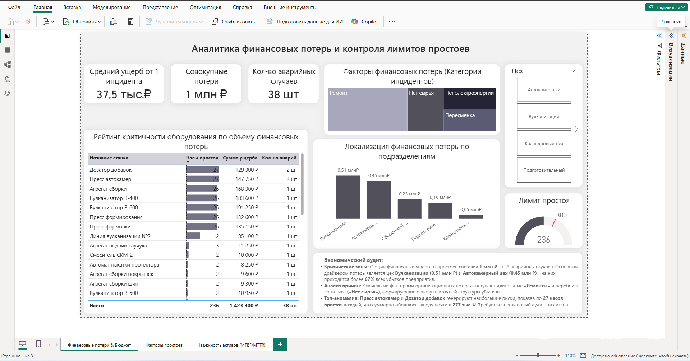
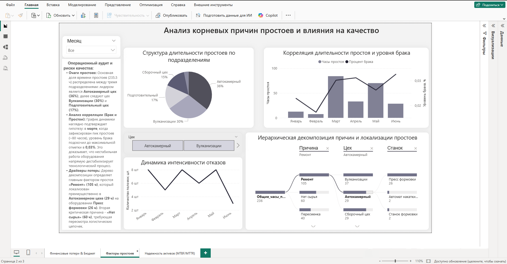
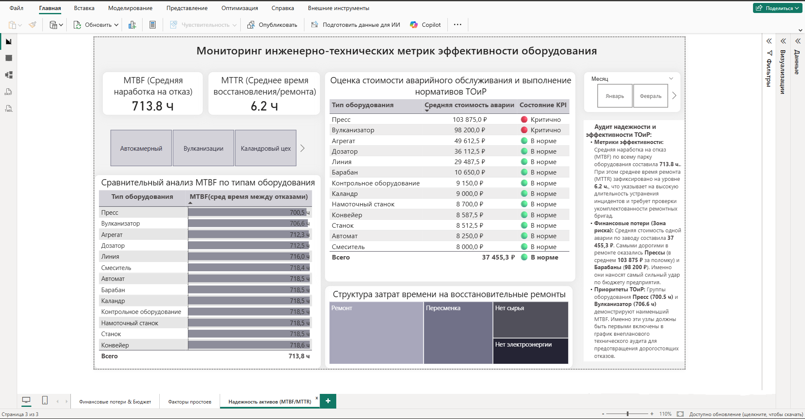

# 📊 BI-система мониторинга операционной эффективности производства и финансового аудита простоев (ТОиР)

## 📌 Бизнес-контекст и проблематика
На промышленном предприятии отсутствовал единый инструмент сквозного контроля, связывающий аварийные остановки оборудования, финансовые убытки и качество готовой продукции. 

**Цель проекта:** Разработать комплексный трехстраничный интерактивный дашборд в **Power BI** для оцифровки финансовых потерь от аварийных остановов, проведения Root Cause Analysis (RCA) и оптимизации графиков планово-предупредительных ремонтов (ППР) на основе показателей надежности (MTBF/MTTR).

---

## 🛠 Архитектура данных и ETL

* **Источник данных:** Датасет (`/data/Production_Downtime_Dataset.xlsx`), из оборудования в 5 производственных цехах.
* **ETL (Power Query):** Реализована параметризованная загрузка данных (`RootPath`). Проект разворачивается на любой рабочей станции без необходимости ручного редактирования запросов.
* **Модель данных:** Архитектура **«Звезда» (Star Schema)**. Таблицы фактов (`Таблица_простои`, `Брак`) связаны со справочниками (`Справочник_оборудования`, `Справочник_цехов`, `Календарь`). Настроена двусторонняя фильтрация для корректной передачи контекста вычислений.

---

## 📊 Структура дашборда и ключевые бизнес-инсайты

### Лист 1: Экономическая эффективность и потери
*Перевод технических аварий на язык финансовых метрик для топ-менеджмента.*

* **Финансовый аудит:** Общий ущерб от аварийных остановов составил **1.42 млн ₽** за 38 инцидентов. 
* **Центры потерь:** Более **67% всех убытков** генерируют два цеха: **цех Вулканизации (0.51 млн ₽)** и **Автокамерный цех (0.45 млн ₽)**.
* **Аномалии оборудования:** Выделены критические узлы (*Пресс автокамер* и *Дозатор добавок*), показавшие экстремальные **27 часов простоя** каждый, что суммарно нанесло ущерб предприятию в размере **277 тыс. ₽**.

---

### Лист 2: Операционный анализ и причины простоев (Root Cause Analysis)
*Поиск первопричин сбоев и оценка их влияния на качество продукции.*

* **Корреляция простоев и брака:** Доказана прямая взаимосвязь между нестабильностью оборудования и выходом некондиционной продукции. В марте, при пике аварийных остановов (~80 часов), уровень технологического брака достиг максимума в **0.03%**.
* **Драйверы потерь (Дерево декомпозиции):** Ключевой фактор простоев - длительные **«Ремонты» (105 ч)**, сфокусированные в Автокамерном цехе (29 ч) на оборудовании *Пресс формовки* (26 ч). Второй по значимости фактор - **«Нет сырья» (60 ч)**, сигнализирующий о сбоях в цепочке поставок (Supply Chain).

---

### Лист 3: Техническая надежность и обслуживание (ТОиР)
*Инструмент операционного контроля для главных инженеров и сервисных служб.*

* **Метрики надежности:** Средняя наработка на отказ (**MTBF**) составила **713.8 ч.** при среднем времени ремонта (**MTTR**) **6.2 ч.** Высокий MTTR указывает на необходимость пересмотра регламентов работы ремонтных бригад.
* **Матрица рисков:** Средняя стоимость одной аварии составила **37 455,3 ₽**. Самыми затратными в обслуживании признаны категории **Пресс (103.8 тыс. ₽ / ремонт)** и **Барабан (98.2 тыс. ₽ / ремонт)**. Группы с минимальным MTBF (*Пресс* - 700.5 ч, *Вулканизатор* - 706.6 ч) определены как приоритетные объекты для включения в график ППР.

---

## 🚀 Инструкция по локальному запуску
1. Клонируйте репозиторий: `git clone https://github.com/mgubina/production-efficiency-and-downtime-analytics.git`
2. Откройте файл `model/Production_Efficiency_and_Downtime_Dashboard.pbix` в Power BI Desktop.
3. В редакторе **Power Query** перейдите в раздел **Параметры** и измените значение `Folder_Path` на путь к локальной папке с файлом `data/Production_Downtime_Dataset.xlsx`.
4. Нажмите **Обновить данные**.
